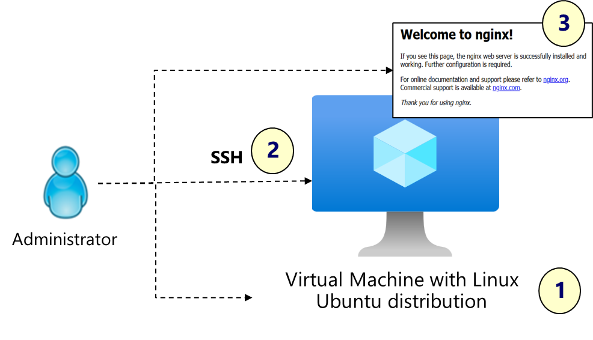
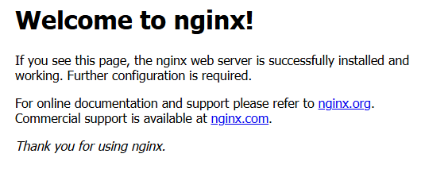

---
lab:
    title: 'Exercise 01: Configure an Azure Linux virtual machine'
    module: 'Guided Project: Deploy and administer Linux virtual machines'
---

# Exercise 01: Configure an Azure Linux virtual machine 

## Lab requirements

This lab requires an Azure subscription. Your subscription type may affect the availability of features in this lab. You may change the region, but the steps were tested using the **(US) East** region.

### Estimated timing: 45 minutes

## Lab scenario

You have been asked to create a web server for a new ecommerce website. You want to explore how to create Linux virtual machines using the Azure portal. You are also interested in using SSH to securely connect to the virtual machine. Lastly, you want to install the latest OS updates and the Nginx web server. 

## Interactive lab simulation

There is an interactive lab simulation that you might find useful for this topic. The simulation lets you click through a similar scenario at your own pace. There are differences between the interactive simulation and this lab, but many of the core concepts are the same. An Azure subscription is not required.

+ [Create a virtual machine in the portal](https://mslearn.cloudguides.com/en-us/guides/AZ-900%20Exam%20Guide%20-%20Azure%20Fundamentals%20Exercise%201). Create a virtual machine, connect and install the web server role.

## Job skills

+ Skill 1: Use the Azure portal to create a virtual machine.
+ Skill 2: Connect to the virtual machine and install OS updates.
+ Skill 3: Install the Nginx web service and test to ensure it is working.

## Azure Virtual Machines Architecture Diagram



## Skill 1: Use the Azure portal to create a virtual machine

In this task, you will create and deploy a Linux virtual machine using the portal. 

1. Sign in to the Azure portal - `https://portal.azure.com`.

    >In this first lab you will use the Azure portal to create the virtual machine. This will give you a good overview of the configuration settings. In a later lab you will use the Azure CLI to create a virtual machine. 

1. **Cancel** the **Welcome to Microsoft Azure** splash screen. 

1. Use the top search box to search for and select `Virtual machines`.

1. Click **+ Create**, and then select in the drop-down **Azure virtual machine**. Notice your other choices.

1. On the Basics tab, continue completing the configuration:

    >Use the Informational icons to learn about each parameter. If a value isn't specified, use the default value. 

    | Setting | Value |
    | --- | --- |
    | Subscription | the name of your Azure subscription |
    | Resource group |  **RG1** (If necessary, click **Create new**) |
    | Virtual machine names | `VM1` |
    | Region | **(US) East US** |
    | Availability options | **No infrastructure redundancy required** |
    | Security type | **Standard** (review your other choices) |
    | Image | **Ubuntu Server 20.04 LTS - x64 Gen2** (use the drop-down to view other options) |
    | Size | **Standard_DS1_v2** (use **See all sizes** to view the CPU and memory) |
    | Authentication type | **SSH public key** (notice you could use a password) |
    | Username | `adminuser` |
    | SSH public key source | **Generate new key pair** (notice your choices to use an existing key) |
    | SSH Key Type | **RSA SSH Format** |
    | Key pair name | `VM1_key` |
    | Public inbound ports |**None** |

    >Did you know [virtual machine sizes](https://learn.microsoft.com/azure/virtual-machines/sizes/overview) are categorized into different families and types, each optimized for specific purposes. For example, compute optimized VM sizes have a high CPU-to-memory ratio. Good for medium traffic web servers, network appliances, batch processes, and application servers.

1. Click **Next: Disks >** , specify the following settings (leave others with their default values):

    | Setting | Value |
    | --- | --- |
    | OS disk size | **Image default (30 GiB)** |
    | OS disk type | **Premium SSD (locally redundant storage** |
    | Delete with VM | **checked** (default) |
    | Enable Ultra Disk compatibility | **Unchecked** |

    >Notice you can add a data disk to the virtual machine. We will do this in a later exercise. 

1. Click **Next: Networking >** and make a few changes. 

    | Setting | Value |
    | --- | --- |
    | Delete public IP and NIC when VM is deleted | **Checked** |
    | Load balancing options | **None** |


1. Click **Next: Management >** and check the following settings (leave others with their default values):

    | Setting | Value |
    | --- | --- |
    | Enable auto-shutdown | **unchecked** |
    | Patch orchestration options | **Image default** |  

    >Patch orchestration options allow you to control how patches will be applied to your virtual machine. 

1. Click **Next: Monitoring >** and specify the following settings (leave others with their default values):

    | Setting | Value |
    | --- | --- |
    | Boot diagnostics | **Disable** |

    >We will review monitoring in another exercise. 

1. Click **Next: Advanced >** and notice the **Custom data** textbox. This is where you would pass a cloud-init script, configuration file, or other data into the virtual machine while it is being provisioned. Do not make any changes.

1. Click **Review + Create**.

1. After the validation passes, click **Create**.

1. When prompted, select **Download private key and create resource**. 

    >If you receive a message, *Can not download private key*, just click the download button again. 

1. Wait for the deployment to complete, then select **Go to resource**. This will take a couple of minutes. 

1. From the **Overview** blade, ensure the virtual machine **Status** is **Running**. 

**Check your learning.** 
 + Can you access the Azure portal?
 + Can you use the Azure portal to create a Linux virtual machine?
 + Can you select the correct the Linux image and virtual machine size?

## Skill 2: Connect to the virtual machine and install OS updates

In this task, you will use SSH to connect to the virtual machine. Connecting will require network traffic to port 22 to be allowed. Once connected, you will check for and update the operating system. 

1. Continue in the portal on the virtual machine page. 

1. On the **Overview** tab, in the top menu, select **Connect** and **Connect** in the drop-down.

1. Select **More ways to connect** to display the possible connection methods. 

1. Review your choices, then select **Native SSH**. 

1. Read the steps on connecting with SSH. Notice that port 22 is not configured to allow access with SSH. This must be corrected before continuing. **Close** the Native SSH page. 

1. In the **Networking** section, select **Network settings**. Notice the Network Security Group (NSG) rules. 

    >A Network Security Group (NSG) acts as a virtual firewall for controlling inbound and outbound traffic to Azure resources. By default, inbound access is allowed from other virtual machines in the virtual network and from load balancers. All other inbound traffic is denied.  

1. Select **Create port rule** and then **Inbound port rule**.

1. In the **Service** drop-down, select **SSH**, then **Add** the rule. 

    >The Nginx web service that you will be installing needs port 80. Repeat the above step to **add** another inbound port rule for service **HTTP**. 

1. Check your work and ensure you have two new inbound port rules to **allow** port 22 and port 80. 

1. In the **Connect** menu (left side) select **Connect** and then **select** Native SSH. Confirm port 22 access is now configured (check mark). It may take a minute for the rule to deploy, if necessary, refresh the page. 

1. Make a note of the **public IP address**. You will need this to connect to the virtual machine. **Close** the Native SSH page. 

1. Open a **CMD** window so you can run the SSH connection string.
   
    >We are using a key pair, but you could also provide a user and password.

1. At the prompt, connect to the virtual machine using SSH. Be sure to  include the correct path to the key and the virtual machine's public_ip_address. Example of key location: *c:\users\admin\downloads\VM1_key.pem*. When prompted, type *yes* to connect. 

    ```cmd
    ssh -i 'c:\users\admin\downloads\VM1_key.pem' adminuser@public_ip_address
    ```

1. Ensure the command is successful and the prompt changes to *adminuser@VM1*. 

1. Fetch the list of available OS updates and install updates. When prompted, type **yes** to continue. Each command must complete successfully. 

    ```sh
    sudo apt update
    ```

   ```sh
    sudo apt upgrade
    ```
1. Stay connected to the virtual machine, leave the CMD window open, and continue to the next task.

**Check your learning.** 
 + Can you configure network security group inbound port rules? 
 + Can you connect to a Linux virtual machine with native SSH?
 + Can you install OS updates on a Linux virtual machine?

## Skill 3: Install the Nginx web service and test to ensure it is working

In this task, you will install the Nginx web service. 

1. Continue working at the CMD prompt. Run these commands one at a time. Ensure each command completes successfully. 

1. Install the Nginx service. When prompted indicate **Y** to continue the install.  

    ```sh
    sudo apt install nginx
    ```
1. Start the Nginx service. 

    ```sh
    sudo systemctl start nginx
    ```

1. Configure Nginx to launch on boot. This is optional but good practice. 

    ```sh
    sudo systemctl enable nginx
    ```

1. Check to ensure the Nginx service is **active (running)**. 

    ```sh
    service nginx status
    ```

1. Launch the Nginx welcome page. Be sure to substitute your virtual machine public IP address. You can also open the Nginx default page in a browser, `http://public_ip_address`.  

    ```sh
    curl -m 80 public_ip_address
    ```

    

    >If the home page times out, check to ensure there is an inbound security rule to allow port 80. 


**Check your learning.** 
 + Can you install software, like Nginx, on a Linux virtual machine?

## Learn more with self-paced training and documentation

+ [Provisioning a Linux virtual machine in Microsoft Azure](https://learn.microsoft.com/training/modules/provision-linux-virtual-machine-in-azure/). Azure allows you to use several common provisioning tools to deploy Linux virtual machines (VMs), to include Terraform, Bicep, the Azure portal, and the Azure CLI. In this module, you'll learn how to deploy a Linux virtual machine using each of these methods.
+ [Quickstart: Create a Linux virtual machine in the Azure portal](https://learn.microsoft.com/azure/virtual-machines/linux/quick-create-portal?tabs=ubuntu) Azure virtual machines (VMs) can be created through the Azure portal. The Azure portal is a browser-based user interface to create Azure resources. This Quickstart shows you how to use the Azure portal to deploy a Linux virtual machine (VM) running Ubuntu Server 22.04 LTS. To see your VM in action, you also SSH to the VM and install the NGINX web server.


## Key takeaways

Congratulations on completing the exercise. Here are the main takeaways:

+ Azure virtual machines are on-demand, scalable computing resources.
+ Configuring Azure virtual machines includes choosing an operating system, size, storage and networking settings. You can create a basic virtual machine by accepting the defaults. 
+ There are several ways to connect to a Linux virtual machine including SSH and Password.
+ To use SSH the virtual machine must have a public IP address and port 22 must be open.  
+ Network Security Group rules let you allow or deny inbound and outbound port connections. For example, port 22 for SSH and port 80 for Nginx. 
