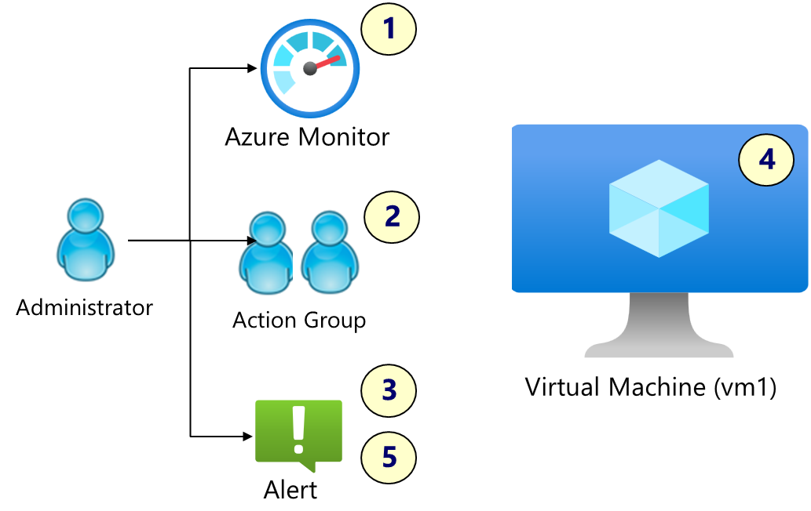

---
lab:
    title: 'Exercise 02: Monitor an Azure Linux virtual machine'
    module: 'Guided Project: Deploy and administer Linux virtual machines'
---

# Exercise 02: Monitor an Azure Linux virtual machine

## Lab requirements

This lab requires an Azure virtual machine. If you don't have a virtual machine, there are optional instructions to create one. 

This lab requires an Azure subscription. Your subscription type may affect the availability of features in this lab. You may change the region, but the steps were tested using the **(US) East** region.

### Estimated timing: 45 minutes

## Lab scenario

Your organization is migrating their virtual machine workloads to Azure. It is important that you are notified of any significant infrastructure changes. You plan to explore the capabilities of Azure Monitor, including alerts and Log Analytics.

## Interactive lab simulation

There is an interactive lab simulation that you might find useful for this topic. The simulation lets you click through a similar scenario at your own pace. There are differences between the interactive simulation and this lab, but many of the core concepts are the same. An Azure subscription is not required.

+ [Implement monitoring](https://mslabs.cloudguides.com/guides/AZ-104%20Exam%20Guide%20-%20Microsoft%20Azure%20Administrator%20Exercise%2017). Create a Log Analytics workspace and Azure-automation solutions. Review monitoring and diagnostic settings for virtual machines. Review Azure Monitor and Log Analytics functionality. 

## Architecture diagram

## Job skills

+ Skill 0: Create a virtual machine (import a template). 
+ Skill 1: Configure VM Insights. 
+ Skill 2: Configure action groups and notifications. 
+ Skill 3: Create alerts.
+ Skill 4: Trigger an alert by resizing the virtual machine.
+ Skill 5: Configure an alert processing rule (optional).

## Skill 0: Create a virtual machine (import a template)

In this task, you will use a template to deploy a virtual machine. 

1. Download the **\\Allfiles\\Lab02\\** lab files.

1. Sign in to the **Azure portal**, `https://portal.azure.com`.

1. **Cancel** the **Welcome to Microsoft Azure** splash screen.

1. Search for and select `Deploy a custom template`.

1. On the custom deployment page, select **Build you own template in the editor**.

1. On the edit template page, select **Load file**.

1. Locate and select the **\\Allfiles\\Lab02\\azuredeploy.json** file and select **Open**.

    >**Note:** Take a moment to review the template. We are deploying a virtual network with a Linux virtual machine.

1. **Save** your changes.

1. Use the following information to complete the custom deployment fields, leaving all other fields with their default values:

    | Setting       | Value         | 
    | ---           | ---           |
    | Subscription  | Your Azure subscription |
    | Resource group| `RG1` (If necessary, select **Create new**)
    | Region        | **(US) East US**   |
    | Vm name       | `VM2` |
    | Username      | `adminuser`   |
    | Password      | Provide a complex password (make a note of this, you will need it later) |

1. Select **Review + Create**, then select **Create**.

## Skill 1: Configure VM insights

In this task, you will enable Insights for a virtual machine. 

1. Continue in the Azure portal. 

1. Search for and select your virtual machine. Before proceeding, ensure the VM status is **Running**. 

1. In the **Monitoring** section, select **Insights**, and then **Enable**.

    >[VM insights](https://learn.microsoft.com/azure/azure-monitor/vm/vminsights-enable-overview) is a method for monitoring the client workloads on your virtual machines and virtual machine scale sets. VM Insights collects performance data, displays an inventory of your existing VMs, and provides a guided experience to enable base monitoring for them.

1. For **Data collection rule**, select **Create New**. 

    >[Data collection rules](https://learn.microsoft.com/azure/azure-monitor/vm/monitor-virtual-machine-data-collection) provide a consistent and centralized way to define and customize different data collection scenarios. 

1. Set the **Data collection rule name** to `VM2Rule1`.

1. Notice the drop-down for **Log Analytics workspace**. Take the default, but notice you could make another selection. 
  
1. Review the defaults and then select **Create**. 

1. Ensure your new rule is selected in the **Data collection rule** drop-down, then select **Configure**. 

1. It may take a couple of minutes for VM Insights to deploy. 

1. You do not need to wait for the deployment to finish, continue on. 

**Check your learning**.
 + Can you enable VM Insights on a virtual machine?
 + Can create a data collection rule?
 + Can you select a specific Log Analytics workspace?

## Skill 2: Configure action groups

In this task, you will create an action group and configure a notification method. 
   
1. Continue working on your virtual machine. In the **Monitoring** section, select **Alerts**.

1. Select **+ Create** and then **Action group**.

    >[Action groups](https://learn.microsoft.com/en-us/azure/azure-monitor/alerts/action-groups) are a collection of notification preferences and actions. You can add up to five action groups to an alert rule. Action groups are executed concurrently, in no specific order. Multiple alert rules can use the same action group. 

1. On the **Basics** tab, enter the following values for each setting.

    | Setting | Value |
    |---------|---------|
    | **Project details** |
    | Subscription | your subscription |
    | Resource group | **RG1** |
    | Region | **Global** (default) |
    | **Instance details** |
    | Action group name | `Help Desk` (must be unique in the resource group) |
    | Display name | `Help Desk` |

1. Select **Next: Notifications >**. Notifications determine how the action group is alerted. We will be using email notifications. 

    | Setting | Value |
    |---------|---------|
    | Notification type | Select **Email/SMS message/Push/Voice** |

1. Select **Email**, and in the **Email** box, enter your email address, and then select **OK**. 

    >You should receive an email notification saying you were added to an action group. There may be a few minutes delay.

1. Complete the **Notifications** tab by adding a **Name** for the action group, `Help Desk`.

1. Finish creating the action group by selecting **Review + Create** and then **Create**. 

**Check your learning.**
 + Can you create an alert action group?
 + Can you configure how the action group is notified when an alert is triggered? 

## Skill 3: Create alerts

In this task, you will create two alert rules. 

1. In the **Monitor** section, select **Alerts**.

    >[Virtual machine alerts](https://learn.microsoft.com/azure/azure-monitor/vm/monitor-virtual-machine-alerts) are automated notifications in Azure Monitor that provide insights into the status of Azure resource. There are no preconfigured alert rules for virtual machines, but there is a set of recommended alert rules you can enable. Or you can just create your own. 

1. Select **Create +** and select **Alert rule**. 

### Create an alert rule based on CPU percentage usage

1. In the **Signal name** drop-down select **Percentage CPU**. 

1. You want to be alerted when the CPU threshold is over 90%. So, change the **Threshold value** to `90`.

    >Alerts can be based on metrics. Metrics are numerical values that are automatically collected at regular intervals and describe some aspect of a resource. For example, this metric would tell you the processor utilization of a virtual machine.

1. You also need to adjust the **When to evaluate** settings. It is important to be reasonable about how often the alert is checked. 

    | Setting | Value |
    |---------|---------|
    | Loopback period | `1 hour` |
    | Check every | `1 hour` |

1. Select **Next: Actions>** tab, **Use action groups**, then choose the **Help Desk** action group and click **Select**. 

1. Move to the **Details** tab, complete the required information. 

    | Setting | Value |
    |---------|---------|
    | Severity | `2 - Warning` |
    | Alert rule name | `VM2CPUAlert` |
   

1. Select **Review + create**, then select **Create**.

### Create an alert based on log activity

1. Select **Create +** and select **Alert rule**. 

1. On the **Condition** tab select **See all signals**.

1. Search for and select **Create or update virtual machine (Virtual Machines)**. **Apply** your changes. 

    >This alert is based on information from a log search. Logs are stored in a [Log Analytics workspace](https://learn.microsoft.com/azure/azure-monitor/logs/log-analytics-workspace-overview). 

1. In the **Alert logic** area (scroll down) review the **Event level** selections. Leave the default of **All selected**.

1. Review the **Status** drop-down selections. Leave the default of **All selected**.

1. On the **Actions** tab, **Use action groups**, then choose the **Help Desk** action group and click **Select**.

1. Move to the **Actions** tab, **Select action groups**, then choose the **Help Desk** action group and click **Select**.

    >This exercise uses an action group, but an alert doesn't require an action group. 

1. Move to the **Details** tab and enter the following values for each setting.

    | Setting | Value |
    |---------|---------|
    | Alert rule name | `VM2changed` |
    | Alert rule description | `VM2 was updated or deleted.` |

1. Select **Review + create**, then select **Create**.

**Check your learning.**
 + Can you create a virtual machine alert based on metrics?
 + Can you create a virtual machine alert based on log activity?
 + Can you assign an action group to an alert?

## Skill 4: Trigger an alert by resizing the virtual machine

In this task, you will review performance data and resize a virtual machine. 

1. Continue working with your virtual machine. 

1. In the **Monitoring** section select the **Metrics** blade. Take a few minutes to explore.
    + You can create a variety of different charts, like a **Line chart**. 
    + You can **Scope** the chart to include one or more virtual machines. 
    + You can select the **Metrics** to include in the chart.
    + You can create a **New alert rule** from your data. 
    + You can **Save to the dashboard**. 

1. In the **Monitoring** section select the **Logs** blade. If necessary, **close** the **Welcome to Log Analytics** page. Take a few minutes to explore.

    + In the **Topic** drop-down select **Resource type** and then **Virtual machines**.
    + Notice there are a large number of built-in queries that might be of interest. For example, the **Count heartbeats** or **Virtual Machine available memory**.
    + Take time to explore and **Run** any queries of interest.
    + Depending on the virtual machine activity, there may not be a lot of events. 

1.  Based on your monitoring review you learn the CPU percentage is close to being maxed out. You decide to increase the number of CPUs. 

    >You can scale the VM up or down by [changing the VM size](https://learn.microsoft.com/azure/virtual-machines/sizes/resize-vm?tabs=portal). In some cases, you must deallocate the VM first. 

1. In the **Availability + scale** blade, select **Size**.

1. Set the virtual machine size to **DS2_v2** and click **Resize**. If prompted, confirm the change.

    >Choose another size if **Standard DS2_v2** is not available. Resizing is also known as vertical scaling, up or down.

    

1. Navigate to the **Alerts** blade. Resizing the virtual machine should have triggered your VM2Changed alert rule. If needed, **Refresh** the page. 

1. Select an alert and review the details. **Edit** the **User response** and ensure the status is **Acknowledged**. **Save** your changes. 

1. You should also receive an email notification that reads, **Important notice: Azure Monitor alert VM was updated...** If not, open your email program and look for an email from azure-noreply@microsoft.com.

**Check your learning.**
 + In the portal, can you access and review virtual machine metrics and logs?
 + Can you resize a virtual machine?
 + Can you manage alerts? For example, acknowledge that an alert has been reviewed. 

## Skill 5: Configure an alert processing rule (optional)

In this task, you create an alert processing rule. 

1. Continue in the **Alerts** blade, select **Alert processing rules** and then **+ Create**. 

    >[Alert processing rules](https://learn.microsoft.com/azure/azure-monitor/alerts/alerts-processing-rules?tabs=portal) decide what happens when an alert is triggered. Alert processing rules can be used to suppress alert notification during maintenance periods. 
   
1. Notice the alert scope is **VM2**. 
   
1. Select **Next: Rule settings**, then select **Suppress notifications**.
   
1. Select **Next: Scheduling**.
   
1. Define a rule to suppress notifications during overnight maintenance. 

    | Setting | Value |
    |---------|---------|
    | Apply the rule | At a specific time |
    | Start | Enter today's date at 10 pm. |
    | End | Enter tomorrow's date at 7 am. |
    | Time zone | Select the local time zone. |

1. Select **Next: Details** and enter these settings:

    | Setting | Value |
    |---------|---------|
    | Resource group | **RG1** |
    | Rule name | `Planned Maintenance` |
    | Description | `Suppress notifications during testing.` |

1. Select **Review + create** to validate your input, then select **Create**.

**Check your learning.**
 + Can you configure an alert processing rule? For example, to suppress alerts during a maintenance period. 

## Learn more with self-paced training

+ [Improve incident response with alerting on Azure](https://learn.microsoft.com/en-us/training/modules/incident-response-with-alerting-on-azure/). Respond to incidents and activities in your infrastructure through alerting capabilities in Azure Monitor.
+ [Monitor your Azure virtual machines with Azure Monitor](https://learn.microsoft.com/en-us/training/modules/monitor-azure-vm-using-diagnostic-data/). Monitor your Azure VMs by using Azure Monitor to collect and analyze VM host and client metrics and logs.

## Key takeaways

Congratulations on completing the exercise. Here are the main takeaways:

+ Alerts help you detect and address issues before users notice there might be a problem with your infrastructure or application.
+ You can alert on any metric or log data in the Azure Monitor data platform.
+ An alert rule monitors your data and captures a signal that indicates something is happening on the specified resource.
+ An alert is triggered if the conditions of the alert rule are met. Several actions (email, SMS, push, voice) can be triggered.
+ Action groups include individuals that should be notified of an alert.
+ Alert processing rules decide what happens when an alert is triggered. Alert processing rules can be used to suppress alert notification during maintenance periods. 

