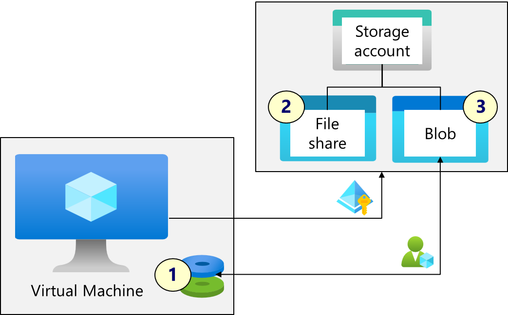

---
lab:
    title: 'Exercise 03: Access storage for an Azure Linux virtual machine'
    module: 'Guided Project: Deploy and administer Linux virtual machines'
---


# Exercise 03: Access storage for an Azure Linux virtual machine

## Lab requirements

This lab requires an Azure subscription. Your subscription type may affect the availability of features in this lab. You may change the region, but the steps were tested using the **(US) East** region.

## Estimated timing: 45 minutes

## Lab scenario

You have been asked to explore how virtual machines can use Azure storage. You want to explore using Azure file shares and Blobs. You want to add and mount a data disk on the virtual machine. Lastly, you want to explore how to transfer data from Azure to the virtual machine with azcopy. 

## Interactive lab simulation 

There is an interactive lab simulation that you might find useful for this topic. The simulation lets you click through a similar scenario at your own pace. There are differences between the interactive simulation and this lab, but many of the core concepts are the same. An Azure subscription is not required.

+ [Create a virtual machine with the CLI](https://mslearn.cloudguides.com/en-us/guides/AZ-900%20Exam%20Guide%20-%20Azure%20Fundamentals%20Exercise%2011). Use the CLI to deploy a virtual machine. Review Azure Advisor recommendations.

## Job skills

+ Skill 1: Create a virtual machine and add a data disk (CLI).
+ Skill 2: Access an Azure file share from the virtual machine.
+ Skill 2: Copy a file from Azure blob storage to the virtual machine data disk.


## Azure Virtual Machines Architecture Diagram



## Skill 1: Create a virtual machine and add a data disk. 

In this task, you will create and configure a virtual machine using the Cloud Shell and the Azure CLI. You will then use the add a data disk and partition and mount the data disk. 

### Configure the Cloud Shell

1. Sign in to the Azure portal - `https://portal.azure.com`.

1. **Cancel** the **Welcome to Microsoft Azure** splash screen.

1. Select the **Cloud Shell** icon in the top right of the Azure Portal.

    

    >The [Cloud Shell](https://learn.microsoft.com/azure/cloud-shell/overview) is an interactive, authenticated, browser-accessible terminal for managing Azure resources. It provides the flexibility of choosing the shell experience that best suits the way you work, either Bash or PowerShell.

1. When prompted to select either **Bash** or **PowerShell**, select **Bash**. 

    >**Did you know?**  If you mostly work with Linux systems, Bash (CLI) feels more familiar. If you mostly work with Windows systems, Azure PowerShell feels more familiar. 

1. Select **No storage account required** and select your **Subscription**.

1. Click **Apply** and wait while a terminal is created. 

1. This lab will use the Azure CLI so check out the documentation for virtual machines. 

    ```sh
    az vm --help
    ```

### Create a virtual machine and add a data disk using the CLI

1. Use the CLI to create a new virtual machine named **vm3** in the **(US) East** region. Notice SSH key file are stored in the /home directory. 

    ```sh
    az vm create --name vm3 --resource-group rg1 --image Ubuntu2204 --admin-username adminuser --generate-ssh-keys --location eastus
    ```

    >This is a very simple implemention of the [az vm create](https://learn.microsoft.com/cli/azure/vm?view=azure-cli-latest#az-vm-create) command. 
    

1. After the machine deploys, ensure the **powerState** is **VM running**. Make a note of the **publicIpAddress**. In a later step, you will need the public IP address and SSH key file to connect to the virtual machine. 

1. Use [az vm disk](https://learn.microsoft.com/en-us/cli/azure/vm/disk?view=azure-cli-latest) to add a 4 GB data disk to the virtual machine.

    ```sh
    az vm disk attach --resource-group rg1 --vm-name vm3 --name Disk1 --new --size-gb 4
    ```

1. Verify the data disk was created. This command will also show the operating system disk information. 

    ```sh
    az disk list --output table
    ```
    >Your next steps will need to be performed on the virtual machine. 

### Connect to the virtual machine and configure the data disk

1. To format and mount the data disk you will need to connect to the virtual machine. Substitute your public IP address. When prompted, confirm you want to connect. When successfully connected, the prompt will change to *adminuser@vm3*.

    ```sh
    ssh -i ~/.ssh/id_rsa.pem adminuser@public_ip_address
    ```

    >The following steps are based on the [format and mount the disk](https://learn.microsoft.com/azure/virtual-machines/linux/add-disk?tabs=ubuntu#format-and-mount-the-disk) documentation. 

1. Retrieve information about the virtual machine storage. Make a note of the name of your new 4 GB disk. For example, **sdc**. 


    ```sh
    lsblk -o NAME,SIZE,MOUNTPOINT
    ```

1. Use *parted* to partition the disk. If necessary, change *sdc* to your disk name. 

    ```sh
    sudo parted /dev/sdc --script mklabel gpt mkpart xfspart xfs 0% 100%;
    ```

1. Use *partprobe* to inform the operating system of partition table changes. If necessary, change *sdc* to your disk name. 

    ```sh
    sudo partprobe /dev/sdc 
    ```

1. Use *mkfs* to build the Linux file system. If necessary, change *sdc* to your disk name. 

    ```sh
    sudo mkfs.xfs /dev/sdc1
    ```

1. Make a directory

    ```sh
    sudo mkdir /datadrive
    ```

1. Mount the data disk to the directory.

    ```sh
    sudo mount /dev/sdc1 /datadrive
    ```

1. Verify the disk now has a mount point. 

    ```sh
    df
    ```

1. Verify there are no files on the data disk.

    ```sh
    ls /datadrive
    ```

1. Minimize the Cloud Shell, but don't close the connection. In the next task, you will continue working in the virtual machine. 

**Check your learning.**
 + Can you access and configure the Cloud Shell?
 + Can you create a virtual machine using the CLI?
 + Can you add a data disk to a virtual machine (portal or CLI)?
 + Can you partition and mount a data disk, so it is usable?

## Skill 2: Access an Azure file share from the virtual machine

In this task, you will create a storage account and file share. You will then give the virtual machine access to the file share and connect to the file share. 

### Create and configure a storage account

1. Switch to the portal. 

1. Search for and select `Storage accounts`.

    >An [Azure storage account](https://learn.microsoft.com/azure/storage/common/storage-account-overview) contains all of your Azure Storage data objects: blobs, files, queues, and tables. The storage account provides a unique namespace for your data that's accessible from anywhere in the world over HTTP or HTTPS. 

1. Select **+ Create** and on the **Basics** tab specify the following settings.

    | Setting | Value |
    | --- | --- |
    | Subscription          | your Azure subscription  |
    | Resource group        | **RG1** (create new if necessary) |
    | Storage account name  | any globally unique name between 3 and 24 characters in length consisting of letters and digits |
    | Region                | **(US) East**  |
    | Performance           | **Standard** (notice the Premium option) |
    | Redundancy            | **Geo-redundant storage** (notice the other options)|
    | Make read access to data in the event of regional availability | Check the box |

    >Did you notice a Network Watcher resource group? This is because we took the defaults when we created the virtual machine. 

1. Select **Review + Create** and then **Create**.

1. Wait for the deployment to finish, then select **Go to resource**. 

### Create and configure a file share

1. In the **Data storage** section, click **File shares**. 

    >[Azure Files](https://learn.microsoft.com/azure/storage/files/) offers fully managed file shares in the cloud that are accessible via the industry standard Server Message Block (SMB) protocol, Network File System (NFS) protocol, and Azure Files REST API. 

1. Select **+ File share** and on the **Basics** tab give the file share a name, `share1`. 

1. On the **Backup** tab, ensure **Enable backup** is **not checked**.

    >You will configure backups in another lab. 

1. Select **Review + create**, and then **Create**. Wait for the file share to deploy.

1. Select **Upload** and **Browse for files**. 

1. Select a file and then click **Upload**.

    >If you have downloaded the lab files, there is a `filedoc.txt` file for you to use.
    
1. Select **Browse** left menu, to ensure your file was uploaded. 

1. Select **Connect**. 

    >The portal provides scripts to help connect from Windows, Linux, and macOS. 

1. Switch to the **Linux** tab and select **Show script**. 

1. **Copy to the clipboard** (icon bottom right in the script). 

### Give the virtual machine authentication to the storage account

1. Your virtual machine must be able to authenticate to the storage account.

1. In the portal, locate your virtual machine (vm3).

1. In the **Security** settings, select **Identity**.

1. On the **System assigned** tab, toggle the **Status** to **On**.

    >A system-assigned [managed identity](https://learn.microsoft.com/entra/identity/managed-identities-azure-resources/overview) is an identity created and managed by Azure for a specific service instance. The managed identity allows the resource to access other Azure resources without storing credentials.

1. **Save** your changes and select **Yes** to **Enable system assigned managed identity**. 

### Run the connect script on the virtual machine and test the file share. 

1. Switch to the Cloud Shell and your virtual machine connection.

1. Create a connection script using the vi editor. If you prefer you may use another editor.


    ```sh
    vi script.sh
    ```
    
1. Right click and **Paste as plain text**. Your connection script should display. 

1. Type **:wq** to write and quit. **Enter** to exit the editor.

1. Run the script.

    ```sh
    sh script.sh
    ```

1. Verify you are able to access the file share. The file you uploaded should be listed. 

    ```sh
    ls /mnt/share1
    ```

1. Copy the file share file to the virtual machine data disk.

    ```
    sudo cp /mnt/share1/* /datadrive
    ```

1. Verify the file share was copied to the data disk. 

    ```sh
    ls /datadrive
    ```
1. Minimize the Cloud Shell, but don't close the connection. In the next task, you will continue working on the virtual machine. 

**Check your learning**
 + Can you create a storage account in the portal (not part of the credential)?
 + Can you create a file share and upload a file in the portal (not part of the credential)?
 + Can you use the portal to get a script to connect a virtual machine to the file share?
 + Can you assign a managed identity to the virtual machine so it can access a resource, like a storage account?
 + Can you run a script to mount the file share from the virtual machine?

### Skill 3: Copy a file from Azure blob storage to the virtual machine data disk

In this task, you will create a blob container. You will assign an Azure role to storage account. Lastly, you will use azcopy to transfer files to the virtual machine. 

### Create a blob storage container with test file

1. Switch to the portal and your storage account. 

1. In the **Data storage** section, click **Containers**.

    >[Azure blob storage](https://learn.microsoft.com/azure/storage/blobs/storage-blobs-introduction) is an object storage solution optimized for storing massive amounts of unstructured data. Blob storage is organized into containers. 

1. Click **+ Container** and **Create** a container with the following settings:

    | Setting | Value |
    | --- | --- |
    | Name | `data`  |
    | Public access level | Notice the access level is set to private |

1. Select your **data** container and then click **Upload**.

1. **Browse for files**. Select a file then click **Upload**.

    >If you have downloaded the lab files, there is a `blobimage.png` file for you to use.

1. Select your uploaded file and copy the **URL**. 

### Assign the virtual machine the Storage Blob Data Contributor role to the storage account

1. In the portal, search for and select **vm3**.

1. In the **Security** settings, select **Identity**.

1. Select **Azure role assignments**. 

    >Azure [RBAC](https://learn.microsoft.com/azure/role-based-access-control/overview) helps you manage who has access to Azure resources. There are many Azure roles that can be assigned, or you can create a custom set of permissions.

1. Select **Add role assignment (Preview)** and provide the managed identity access to the storage account file share. Both read and write capability is required. **Save** your changes. 

    | Setting | Value |
    | --- | --- |
    | Scope | **Storage** |
    | Subscription          | your Azure subscription  |
    | Resource       | select your storage account |
    | Role | **Storage Blob Data Contributor** |

    >There are many [storage roles](https://learn.microsoft.com/en-us/azure/role-based-access-control/built-in-roles/storage#storage-blob-data-contributor) , including roles specifically for the storage account and for Blob storage. The **Storage Blob Data Contributor** role provides read, write, and delete on Azure storage containers and blobs. 

### Use AzCopy to transfer files

1. Return to the Cloud Shell and ensure you are still connected to vm3. 

1. Download AzCopy and extract the file.

    >[AzCopy](https://learn.microsoft.com/azure/storage/common/storage-ref-azcopy) is a command-line tool that moves data into and out of Azure Storage.

    ```sh
    wget https://aka.ms/downloadazcopy-v10-linux
    ```
    
    ```sh
    sudo tar xzf downloadazcopy-v10-linux
    ```
1. Make folder for azcopy and copy the executable to that directory. 

    ```sh
    sudo mkdir /opt/azcopy
    ```
    
    ```sh
    sudo cp ./azcopy_linux_amd64_*/azcopy /opt/azcopy/
    ```


1. Run this command to login azcopy as the virtual machine managed identity. Ensure there is a **succeeded** response.

    ```sh
    sudo /opt/azcopy/azcopy login --identity
    ```

1. Copy from Azure blob storage to the new virtual machine data drive. Substitute the blob file URL you copied from the portal. 

    ```
    sudo /opt/azcopy/azcopy copy "urlblob" /datadrive
    ```

1. Verify the file you uploaded to blob storage has been copied to the /datadrive. 

    ```
    ls /datadrive
    ```
    
**Check your learning**
 + Can you use requirements to identify the best Azure storage role to use?
 + Can you add a role assignment to a resource, like a virtual machine?
 + Can you install the AzCopy utility on a virtual machine?
 + Can you login with AzCopy and the managed identity?
 + Can you use AzCopy to transfer files between a virtual machine and an Azure storage account?

## Learn more with self-paced training

+ [Configure storage accounts](https://learn.microsoft.com/training/modules/configure-storage-accounts/). Learn about Azure storage accounts. This includes storage account types and replication strategies. 

+ [Configure Azure file shares and file sync](https://learn.microsoft.com/training/modules/configure-azure-files-file-sync/). Learn how to configure Azure file shares. 

+ [Add and size disks in Azure virtual machines](https://learn.microsoft.com/training/modules/add-and-size-disks-in-azure-virtual-machines/). Understand and create the different types of disk storage available to Azure virtual machines (VMs). This includes adding a data disk and resizing a data disk. 

+ [Implement access management for Azure resources](https://learn.microsoft.com/training/modules/implement-access-management-for-azure-resources/). Explore how to use built-in Azure roles, managed identities, and RBAC-policy to control access to Azure resources. Identity is the key to secure solutions.

## Key takeaways

Congratulations on completing the exercise. Here are the main takeaways:

+ An Azure storage account contains non-relational data including blobs and files. 
+ Azure file shares are accessible with the SMB protocol, NFS protocol, and Azure Files REST API. 
+ Azure virtual machine data disks are block-level storage volumes. 
+ Azure blob storage is optimized for storing massive amounts of unstructured data, like images and videos. 
+ AzCopy is a utility to transfer data from virtual machines to Azure storage accounts. 

