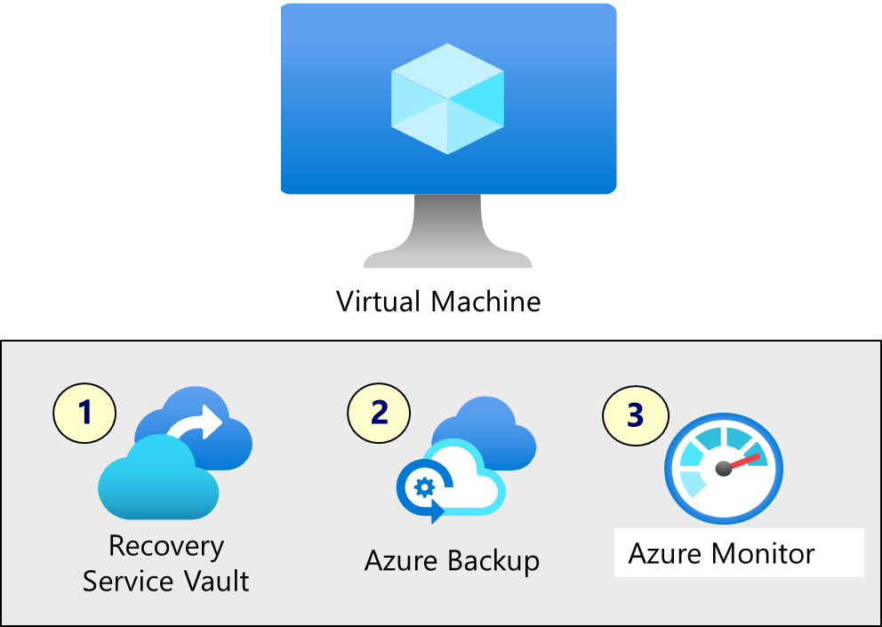

---
lab:
    title: 'Exercise 04: Back up Azure Linux virtual machines'
    module: 'Guided Project: Deploy and administer Linux virtual machines'
---
# Exercise 04: Back up Azure Linux virtual machines

## Lab requirements    

This lab requires an Azure virtual machine. If you don't have a virtual machine, there are instructions to create one. 

This lab requires an Azure subscription. Your subscription type may affect the availability of features in this lab. You may change the regions, but the steps were tested using the **(US) East** region.

### Estimated timing: 30 minutes

## Lab scenario

Your organization is evaluating how to backup Azure virtual machines. Backup will protect the virtual machines from accidental or malicious data loss. You plan to explore using the Azure Backup Center.

## Interactive lab simulation

There is an interactive lab simulation that you might find useful for this topic. The simulation lets you click through a similar scenario at your own pace. There are differences between the interactive simulation and this lab, but many of the core concepts are the same. An Azure subscription is not required.

+ **[Backup virtual machines and on-premises files.](https://mslabs.cloudguides.com/guides/AZ-104%20Exam%20Guide%20-%20Microsoft%20Azure%20Administrator%20Exercise%2016)**. Create a recovery services vault and implement an Azure virtual machine backup. Implement on-premises file and folder backup using the Microsoft Azure Recovery Services agent. On-premises backups are outside the scope of this lab, but it might be helpful to view those steps. 

## Job skills

+ Skill 0: Create a virtual machine (Quickstart template). 
+ Skill 1: Create and configure a Recovery Services vault.
+ Skill 2: Configure Azure virtual machine-level backup.
+ Skill 3: Connect to a Linux virtual machine using a user and password  (optional)

### Estimated timing: 30 minutes

## Architecture diagram



## Skill 0: Create a virtual machine 

In this task, you will deploy a template to create a Linux virtual machine. If you already have a virtual machine to use for this exercise, then skip to Skill 1. 

1. Sign in to the Azure portal - `https://portal.azure.com`.

1. **Cancel** the **Welcome to Microsoft Azure** splash screen.
 
1. Search for and select `Deploy a custom template.`

1. Notice your choices and select **Create a Linux virtual machine.**

1. Take the defaults, except for these required settings. 

    | Settings | Value |
    | --- | --- |
    | Subscription | the name of your Azure subscription |
    | Region | `East US 2` |
    | Resource group | `RG1`  |
    | Vm name | `VM4` |
    | Admin user name | `adminuser` |
    | Authentication type | **Password** |
    | Admin Password or Key | provide a complex password |

1. Click **Review + Create**. Ensure that the validation passes and then click **Create**.

1. You can continue to the next task while the virtual machine deploys. 


## Skill 1: Create and configure a Recovery Services vault

In this task, you will create a Recovery Services vault. 

1. In the Azure portal, search for and select `Recovery Services vaults`.

    >A [Recovery Services vault](https://learn.microsoft.com/azure/backup/backup-azure-recovery-services-vault-overview)  is a storage entity in Azure that houses data. The data is typically copies of data, or configuration information for virtual machines, workloads, servers, or workstations. 

1. On the **Recovery Services vaults** blade, click **+ Create**.

1. On the **Create Recovery Services vault** blade, specify the following settings:

    | Settings | Value |
    | --- | --- |
    | Subscription | the name of your Azure subscription |
    | Resource group | `RG1`  |
    | Vault Name | `RSV1` |
    | Region | **East US** |

    >Make sure you use the same region as the virtual machines.

1. Click **Review + Create**, ensure that the validation passes and then click **Create**.

    >Wait for the deployment to complete. The deployment should take a couple of minutes. 

1. When the deployment is completed, click **Go to Resource**.

1. In the **Protected items** section select **Backup items**. Notice the vault does not yet contain any backups. 

**Check your learning**
 + Can you create and configure a Recovery Service vault?
 + Can you determine which protected items are in the vault?


## Skill 2: Configure Azure virtual machine-level backup

In this task, you will implement Azure virtual machine level backup. As part of a VM backup, you will define a backup and retention policy.

1. Continue working on the Recovery Services vault, click **Overview**, then click **+ Backup**.

    >When you [enable a virtual machine backup](https://learn.microsoft.com/azure/backup/quick-backup-vm-portal#enable-backup-on-a-vm) you can configure a backup schedule and retention range. 

1. On the **Backup Goal** blade, specify the following settings:

    | Settings | Value |
    | --- | --- |
    | Where is your workload running? | **Azure** (notice your other options) |
    | What resource do you want to back up? | **Virtual machine** (notice your other options |

1. Select **Backup**.

1. Notice there a two **Policy sub types**: **Enhanced** and **Standard**. Review the choices and select **Enhanced**. 

1. In **Backup policy**, select **Create a new policy**.

1. Define a new backup policy with the following settings (leave others with their default values):

    | Setting | Value |
    | ---- | ---- |
    | Policy name | `vmbackup` |
    | Frequency | **Daily** |
    | Time | **12:00 AM** |
    | Timezone | the name of your local time zone |
    | Retain instant recovery snapshot(s) for | **2** Days(s) |

1. Click **OK** to create the policy and then, in the **Virtual Machines** section, select **Add**.

    >You can create multiple backup policies or reuse a single backup policy on multiple virtual machines. 

1. On the **Select virtual machines** blade, select **VM4**, click **OK**.

1. On the **Backup** blade, click **Enable backup**.

    >Wait for the backup to be enabled. This should take approximately 2 minutes.

1. In the **Protected items** section, click **Backup items**, and then click the **Azure virtual machine** entry.

1. Select the **View details** link for **VM4** and review the values of the **Backup Pre-Check** and **Last Backup Status** entries.

    >Notice the backup is *initial backup pending*.
    
1. Select **Backup now**, accept the default value in the **Retain Backup Till** drop-down list, and click **OK**. Do not wait for the backup to finish.

**Check your learning**
 + Do you know the difference between an Enhanced and Standard backup policy?
 + Can you configure backup policy retention settings?
 + Can you review the backup job details and status?

## Skill 3: Connect to a Linux virtual machine using a user and password  (optional)

This exercise doesn't require you to connect to the virtual machine. However, it is important to be able to connect using a user and password. So, in this task let's practice this skill.

1. In the portal, locate your virtual machine.

1. On the **Overview** blade, make note of the public IP address.

1. Open a **Command Prompt** window. 

1. At the prompt, use SSH and your public IP address to connect to the virtual machine.

    ```sh
    ssh adminuser@public_IP_address
    ```

1. If prompted to continue, type *yes*.

1. Provide the virtual machine password. Note the password will not display in the command window. 

1. Ensure the prompt changes, to *adminuser@public_IP_address*.

**Check your learning**

+ Can you connect to a Linux virtual machine with a user and password?

## Learn more with self-paced training

+ [Protect your virtual machines by using Azure Backup](https://learn.microsoft.com/training/modules/protect-virtual-machines-with-azure-backup/). Use Azure Backup to help protect on-premises servers, virtual machines, SQL Server, Azure file shares, and other workloads.

## Key takeaways

Congratulations on completing the exercise. Here are the main takeaways:

+ A Recovery Services vault stores your backup data and minimizes management overhead.
+ Azure Backup service provides simple, secure, and cost-effective solutions to back up and recover your data.
+ Azure Backup can protect on-premises and cloud resources including virtual machines and file shares.
+ Azure Backup policies configure the frequency of backups and the retention period for recovery points. 


